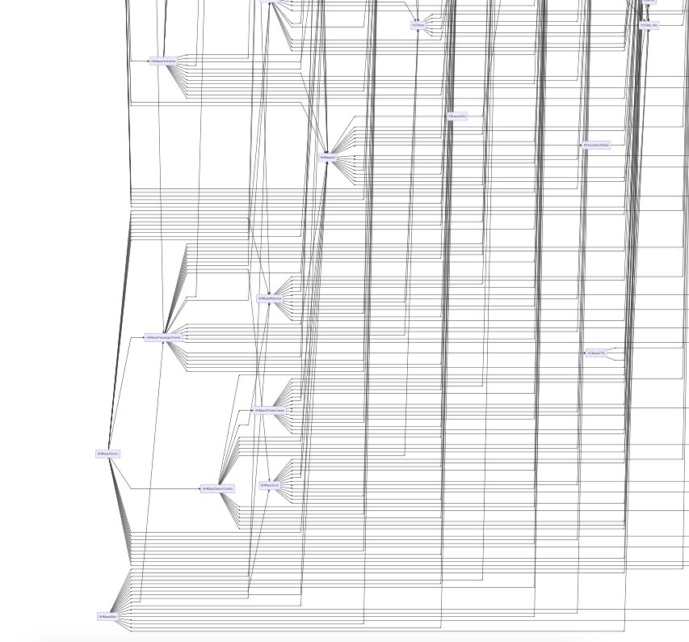
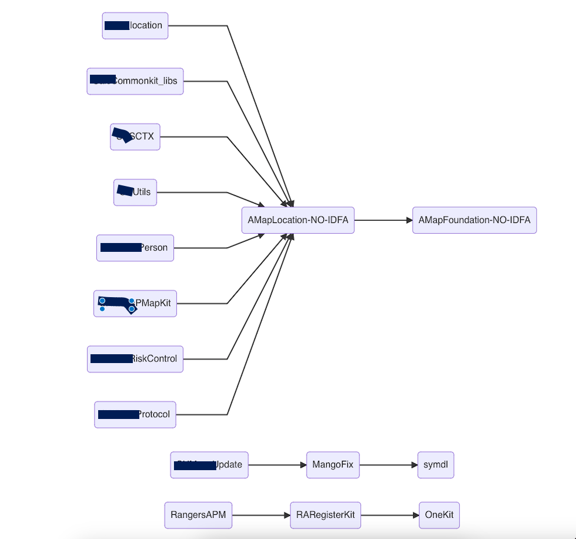

# Podfile
Parse Podfile.lock 解析脚本py， 生成模块的依赖关系，并展示依赖图。上下层依赖关系 md 格式文件，使用Typora 等支持Markdown语法的app打开


修改脚本相对路径：

```python
lockfile_path = '../Podfile.lock'
```

文件路径下执行： 

```shell
python parse_lockfile.py
```

运行后会在当前文件夹里生成多份 Markdown 格式关系图

脚本片段：

```python
print("全局单个依赖json生成...")
with open("depends_graph_all_json.md", "w") as file:
    file.write(depends_all_json)


print("全局单个依赖表生成...")
with open("depends_graph_singles.md", "w") as file:
    file.write(depends_graph_singles)

# 全局依赖表
print("全局依赖表生成...")
with open("depends_graph_all.md", "w") as file:
    file.write(depends_all_msg)


# 全局层级关系列表
print("全局层级关系列表生成...")
with open("depends_hierarchical_relation.md", "w") as file:
    file.write(depends_list_msg)
```


**全局依赖图**

depends_graph_all.md 使用Typora打开片段：




**每个模块的依赖图**

depends_graph_singles.md 使用Typora打开片段：




